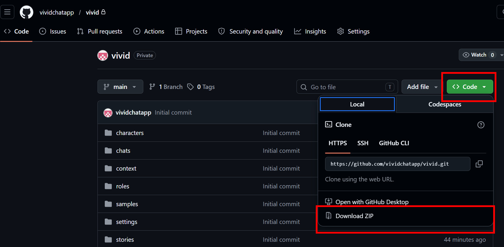
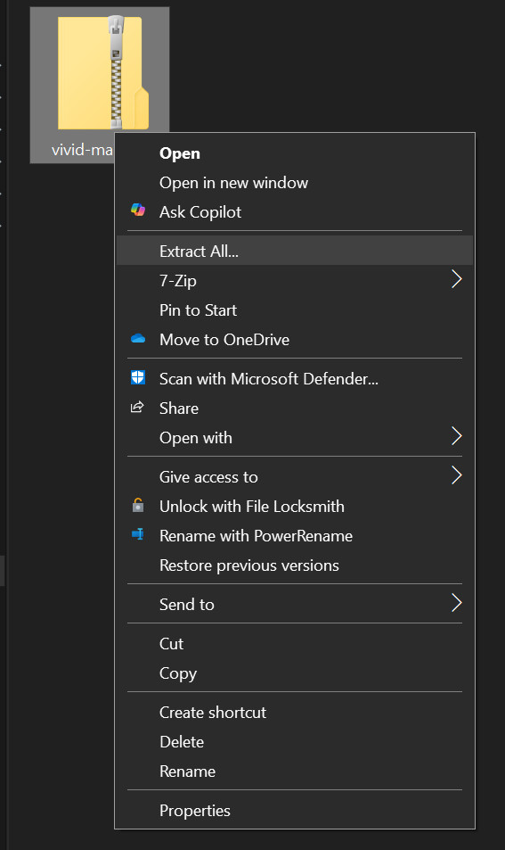
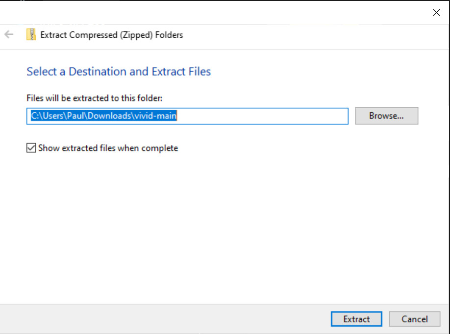

# Vivid Chat 

**Vivid Chat** is a Python-based Telegram chat bot program, vivid is designed for high-flexibility roleplay and conversation management.  
It works with **local Ollama deployments** and **Ollama-hosted online models**, allowing flexible switching between local and remote inference.

---

## 📋 Prerequisites
For assistance with the prerequisites below, you can refer to YouTube or consult an AI like Google Gemini or ChatGPT.
- **Python 3.10+**: Download and install from [python.org](https://www.python.org/downloads/). To verify your installation, run `python --version` in a Windows Command Prompt or a Linux terminal.
- An **Ollama account**: Sign up at [ollama.com](https://ollama.com).
- A **Telegram account**: You must have Telegram installed on your phone or desktop to interact with the bot.
- **GitHub**: If you want to *git clone* the repository; for the average user (mostly Windows 10/11 users), just ***download the ZIP file***. If you are using a **Raspberry Pi**, you should check if **Git** is installed with `git --version`.

*If you are worried that the zip file contains any malicious code, just drag it up to your favorite online chatbot and ask it.*

---

## 🛠️ Installation
**Tip:** If you encounter errors during installation, ChatGPT and Google Gemini are excellent resources. Simply copy and paste the error message or upload the `vivid.py` file to your preferred AI assistant for quick troubleshooting.

For quick installation guides for Windows or Linux / macOS please go to the [Vivid Chat App](https://www.youtube.com/@VividChatApp) YouTube channel.

### 🎥 OS-Specific Installation Guides
- [▶️ Windows Installation Guide](https://www.youtube.com/@VividChatApp)
- [▶️ Linux / macOS Installation Guide](https://www.youtube.com/@VividChatApp)

### 1. Clone the Repository or download the zip (below)
```bash
git clone https://github.com/vividchatapp/vivid
cd vivid
```
### (for non developer types or Windows systems) download the zip

---
extract the zip 



it will unzip to a folder called `vivid-main`



Rename the folder from `vivid-main` to `vivid`. Right-click the folder and select **Rename** (this is optional but recommended).
```bash
rename vivid-main vivid
```
### 2. Set Up a Virtual Environment (Recommended)

#### Windows
```powershell
python -m venv venv
.\venv\Scripts\activate
```

#### Linux / macOS
```bash
python3 -m venv venv
source venv/bin/activate
```

---

### 3. Install Dependencies
> **Note:** Once the virtual environment is activated, your command prompt (Windows) or terminal (Linux/macOS) should be prefixed with `(venv)`. This indicates that you are working within the isolated virtual environment. See Section 5 for visual examples of how the prompt should look.

```bash
pip install -r requirements.txt
```
---

### 4. Configuration
Copy the sample environment file to env.json and edit it as follows:

   **Windows**
   ```powershell
   copy env.json.sample env.json
   notepad env.json
   ```
   **Linux / macOS**
   ```bash
   cp env.json.sample env.json
   nano env.json
   ```
Update the env.json file with the following information:
  - `TELEGRAM_USER_ID`: Your numeric Telegram User ID (get this from `@userinfobot`).
   - `VIVID_PREFIX`: The default bot identifier (must match a key in `TELEGRAM_TOKENS` this can be anything you want, default 'vivid1').
   - `TELEGRAM_TOKENS`: A map of prefixes to bot tokens (get tokens from `@BotFather` using  `/newbot` or `/mybots` command).
   - `OLLAMA_ONLINE`: API keys and descriptions for hosted Ollama-compatible services keys can be found at [https://ollama.com/settings/keys](https://ollama.com/settings/keys) choose `Add API key` button when it is generated paste it to the `api_key` field. You can have multiple keys but that would require multiple accounts. This is handy because Ollama online has usage limits, but since your chat data is stored on your local computer you can just select a different account to continue.
   - `OLLAMA_LOCAL`: IP/host URLs for instances running on a local computer.
---

### 5. Run/Restart vivid.py
Note you must be in the virtual environment `venv`, in order to run vivid.py you should see something like `(venv)` prefixing your command prompt:

Examples
#### linux / macOS
```
(venv) user@raspberrypi:~/vivid $
```
#### windows
```
(venv) PS C:\Dev\vivid>  
```

If you don't see the `(venv)` prefix, you can activate the virtual environment by typing the commands below to activate it:
#### Windows
```powershell dos
.\venv\Scripts\activate
```

#### Linux / macOS
```bash
source venv/bin/activate
```
to run vivid

```bash
python vivid.py
```

or you can run these wrapper commands that start venv automatically (easier to do this)

#### Windows
```powershell dos
vwin.bat
```

For linux / macOS make sure you make `run_vivid.sh` executable by typing:
```bash
chmod +x vlin.sh
```
this only has to be done once. If you do not do this you probably get the error
`-bash: ./run_vivid.sh: Permission denied`
or something similar


#### Linux / macOS
```bash
./vlin.sh
```
---

## 💾 Session & Context Management

Vivid Chat automatically preserves conversations—even if vivid.py crashes.

- Active chat is continuously saved in the `chats/` folder
- Session file format:
  `[VIVID_PREFIX]_last_session.json`

### Crash Recovery or Vivid Restart
If vivid.py crashes or you restart vivid.py, vivid.py will load your last session automatically.

So vivid.py will remember the provider, model, role, character(s), scene(s) and the whole conversation history (context).
These are all kept inside the session json.
`[VIVID_PREFIX]_last_session.json`

---

## 🚀 Commands

Commands are entered in Telegram and are **not stored in context**.
Why '.' dot commands instead of '/' slash commands? This program was written generally for the mobile Telegram app and the '.' is easier to type.\
NOTE: commands documentation (this section) may not be the most up to date. For the most up to date commands, please check `.help` or `.h`
`
### 📖 Help
- `.help` / `.h` — Displays the help menu.

### 🎭 Roles
- `.role` / `.r` — List available role profiles.
- `.role [n]` — Switch to a role by index.
- `.role edit [n]` — Get role text to edit.
- `.role save [name] [text]` — Save or update a role profile file.
- `.reload` — Reload the current role's text file from disk (updates the system prompt in history).
- `.rs [n]` / `.rolesummary [n]` — Summarize the current role profile using a prompt template from `roles_recap.json`.

### 👤 Characters
- `.char` — List characters and their active status.
- `.char [n/name] on/off` — Toggle whether a character's bio is included in the system prompt.
- `.char all off` — Deactivate all characters.
- `.char edit [n]` — Get character bio to edit.
- `.char save [name] [text]` — Save or update a character bio file.

### 🎬 Scenes
- `.scene` / `.sc` — List scene settings and their status.
- `.scene [n/name] on/off` — Toggle whether a scene description is included in the system prompt.
- `.scene all off` — Deactivate all scene settings.cene description file.
- `.scene edit [n]` — Get scene description to edit.
- `.scene save [name] [text]` — Save or update a scene description file.

### 🧠 Providers & Models
- `.provider` / `.p` — List configured Ollama (local/online) providers.
- `.provider [n]` — Switch to a different provider.
- `.model` / `.m` — List models available on the current provider.
- `.model [n]` — Switch to a model by index.
- `.model pull [name]` — (Ollama) Download a new model.
- `.model test` — (Ollama Online) Test models for subscription requirements and save status.
- `.model rm [n]` — (Ollama) Delete a model by index.
- `.model loaded` — (Ollama) Sync vivid's current model with whatever is currently loaded in the provider's RAM.
- `.mf` / `.modelsfiltered` [n/next/prev] — (Ollama Online) List, select, or cycle standard models that do not require an account upgrade.
- `.think` — Toggle "Think Mode" (adds thinking logic/parameters for supported models).
- `.llmctx [nk]` — Set or show the model context window size (e.g., 8k, 32k).
- `.verbose` / `.v` — Toggle display of latency and message metadata.

### 💾 Conversation & Chats
- `.chat` / `.chats` / `.c` — List saved JSON chat files.
- `.chat save [name]` — Save the current session history and metadata.
- `.chat load [name]` — Load a saved conversation.
- `.clear` — Wipe the current conversation history (keeps the active role).
- `.clean` / `.cl` — Wipe memory and delete messages from the Telegram UI.
- `.mode` / `.mo` [chat/story] — Toggle history behavior (full history vs. assistant-only for context).
- `.recap [n]` — Summarize the current conversation history using a template from `recap.json`.
- `.story` / `.store` save [name] — Save all assistant messages from the current chat to a text file.
- `.ask [text]` — Ask a question about the conversation history without affecting context.
- `.del` — Delete the last user message and vivid's response from memory.
- `.resend` — Remove the last user message and re-trigger generation.
- `.context [n]` — View or set the sliding context window limit (number of messages sent to LLM).
- `.last [n]` / `.l [n]` — Show the last `n` messages from the chat history (default 3).

### 📝 Predefined Messages
- `.msg` — List saved predefined messages in the library.
- `.msg [n]` — Send the $n$-th predefined message to the AI.
- `.msg add [text]` — Save a new message to the `messages.json` library.
- `.msg del [n]` — Delete a message by index.
- `.msg edit [n]` — Get the message text pre-formatted for editing.
- `.msg save [n] [text]` — Overwrite an existing message at a specific index.

### ⚙️ Status
- `.status` / `.s` — Show current provider, model, role, active characters/scenes, and session statistics.
- `.verbose` / `.v` — Toggle display of latency and message metadata.
- `.trace [on/off]` — Toggle 'Trace Mode' to write LLM payloads to the context folder.
- `.lazy` / `.lz` — Toggle Lazy Mode.

---

## 📂 Project Structure

```
VividChat/
├── vivid.py
├── requirements.txt
├── env.json
├── chats/
├── roles/
├── settings/
└── README.md
```

---

## 📝 License

Do whatever you want with it.
Built using VS Code + Gemini.

## ▶️ How to Run (Ollama Online Setup)

Vivid Chat works with **Ollama online models**, which require an API key.
This is how I would run it.

## Online Model to Use
**gemma4:31b (58.25 GB)** this gives me the best NSFW roleplay storytelling experience
if it refuses just `.resend`


### 1. Create an Ollama Account

Go to:\
https://ollama.com

Sign up if you don't already have an account.

------------------------------------------------------------------------

### 2. Generate an API Key

1.  Click your profile icon (top-right corner)\
2.  Open **Settings**\
3.  Go to **Keys**\
4.  Click **Generate API Key**\
5.  (Optional) Give it a name\
6.  Click **Create**\
7.  Copy the API key and save it somewhere safe (e.g., Notepad)

------------------------------------------------------------------------

### 3. Add API Key to `env.json`

Paste your API key into the `OLLAMA_ONLINE` section:

``` json
"OLLAMA_ONLINE": [
  {
    "api_key": "PUT_YOUR_KEY_HERE",
    "description": "Ollama 1"
  },
  {
    "api_key": "PUT_YOUR_KEY_HERE",
    "description": "Ollama 2"
  }
]
```

------------------------------------------------------------------------

### 💡 Using Multiple Accounts (Recommended)

Ollama free accounts have usage limits.

To work around this:

-   Create **2 accounts** (for example, using two Gmail addresses)\
-   Generate an API key for each account\
-   Add vividh keys to `env.json`

This allows you to:

-   Switch between accounts when limits are reached\
-   Continue conversations seamlessly (context is stored locally in
    `vivid.py`)

------------------------------------------------------------------------

### 🧠 Notes

-   Context is managed locally, so switching accounts does **not** reset
    your conversation\
-   You don't need a powerful machine --- vivid mainly acts as a controller

Example setup:

-   Running on a **Raspberry Pi Zero W** this is what I am doing it works fine
-   Multiple vivid instances connected to Telegram

------------------------------------------------------------------------

### ✅ Summary

-   Create Ollama account(s)\
-   Generate API key(s)\
-   Add them to `env.json`\
-   Run vivid.py\
-   Switch accounts if limits are reached

### Running locally 
Honestly if you're just intested in NSFW chatting use the online, if not install Ollama and do an `ollama pull [modelname]` I find Gemma 4 models are really good for NSFW roleplay / chatting.